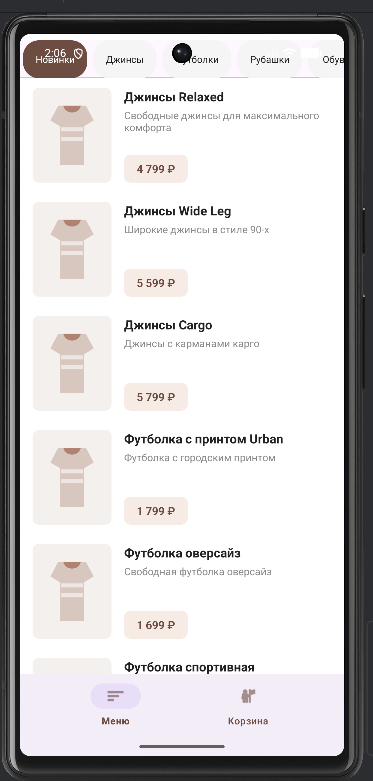
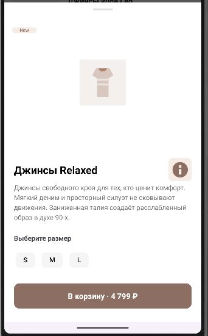
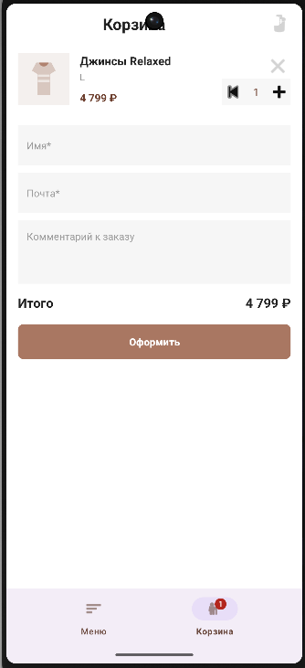
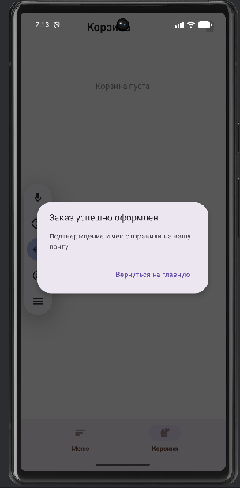

# MEGA Kazino

MEGA Kazino - нативное Android-приложение интернет-магазина одежды, созданное в рамках командного учебного проекта. Приложение показывает каталог товаров, загружает данные из API, кэширует каталог в локальную базу данных, работает с каталогом без сети и поддерживает корзину с оформлением заказа.

## Платформа И Стек

- Платформа: Android
- Язык: Kotlin
- UI: Android Views + XML
- Локальная база данных: Room
- Сеть: `HttpURLConnection` + Gson
- Загрузка изображений: Coil
- Сборка: Gradle Kotlin DSL
- Качество кода: ktlint, Android Lint, JUnit
- IDE: Android Studio

## Команда

- Онищенко Александр (`nightmareunderpants`) - Lead Android Developer, UI/UX Designer, Build & Release, Project Manager
- Калюжко Алексей (`Aleshka228PRO`) - Android Developer
- Троянов Михаил (`papaChill`) - Android Developer

## Возможности

- Каталог товаров с категориями.
- Экран деталей товара.
- Загрузка каталога из удаленного API с bearer-токеном.
- Кэширование каталога в Room.
- Стратегия `cache-first`: сначала показывается локальный кэш, затем данные обновляются из API.
- Работа каталога без подключения к сети.
- Добавление товара выбранного размера в корзину.
- Бейдж количества товаров на иконке корзины.
- Корзина хранится в Room минимально: `productId`, `sizeId`, `quantity`.
- Изменение количества товаров, удаление позиции и очистка корзины.
- Форма оформления заказа с проверкой имени и email.

## Скриншоты

Финальные скриншоты приложения нужно положить в папку `docs/screenshots/`.

### Каталог



### Детали товара



### Корзина



### Успешное оформление заказа



## Архитектура

```text
UI layer
MainActivity
ProductAdapter / CartAdapter
ProductDetailsSheet

State and business logic
CatalogViewModel
CatalogState
CatalogBusinessLogic

Data layer
ProductRepository
CartRepository
CatalogDatabase (Room)
CatalogDao

External sources
Remote catalog API
Room database cache
```

Поток данных каталога:

```text
Catalog screen -> CatalogViewModel -> ProductRepository
ProductRepository -> Room cache -> UI
ProductRepository -> Remote API -> Room cache -> UI
```

Поток данных корзины:

```text
Product details -> CartRepository -> Room cart table
Cart screen -> CartRepository -> Room cart table + cached catalog products -> UI
```

## Как Собрать Проект

1. Клонировать репозиторий:

```bash
git clone https://github.com/FEIP-FEFU-Mobile-Spring-2026/team-tupie-kozirki
cd team-tupie-kozirki
```

2. Открыть корневую папку проекта в Android Studio.

3. Убедиться, что для Gradle используется JDK 17.

4. Убедиться, что установлен Android SDK. Локальный путь к SDK задается в `local.properties`, этот файл не коммитится:

```properties
sdk.dir=C\:/Users/<your-user>/AppData/Local/Android/Sdk
```

5. Выполнить Gradle Sync в Android Studio.

6. Собрать debug-версию:

```bash
gradlew.bat assembleDebug
```

## Проверки Качества

Запуск unit-тестов:

```bash
gradlew.bat testDebugUnitTest
```

Запуск ktlint:

```bash
gradlew.bat ktlintCheck
```

Полная проверка проекта: сборка, тесты, Android Lint и ktlint:

```bash
gradlew.bat build
```

Если в терминале по умолчанию используется JDK 26, Gradle нужно запускать с JDK 17:

```powershell
$env:JAVA_HOME='C:\Program Files\Eclipse Adoptium\jdk-17.0.1.12-hotspot'
$env:Path="$env:JAVA_HOME\bin;$env:Path"
.\gradlew.bat --gradle-user-home .gradle-user build
```
